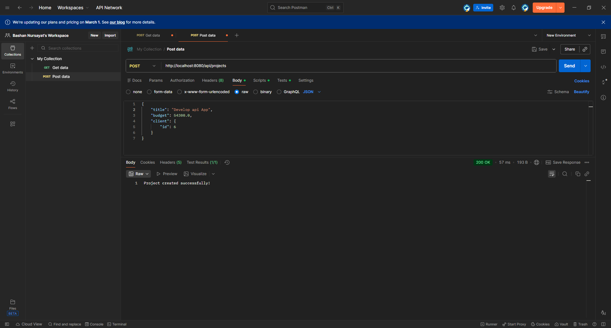
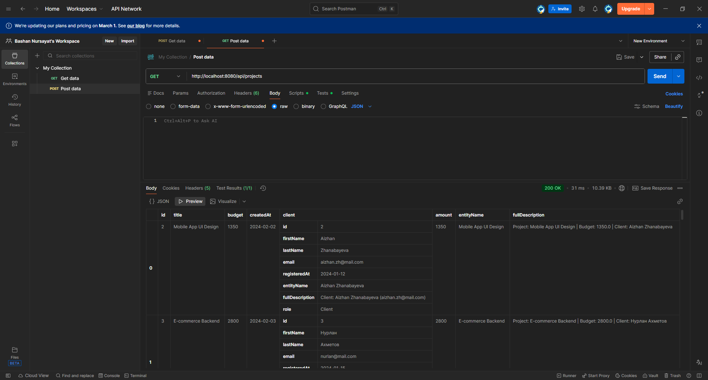
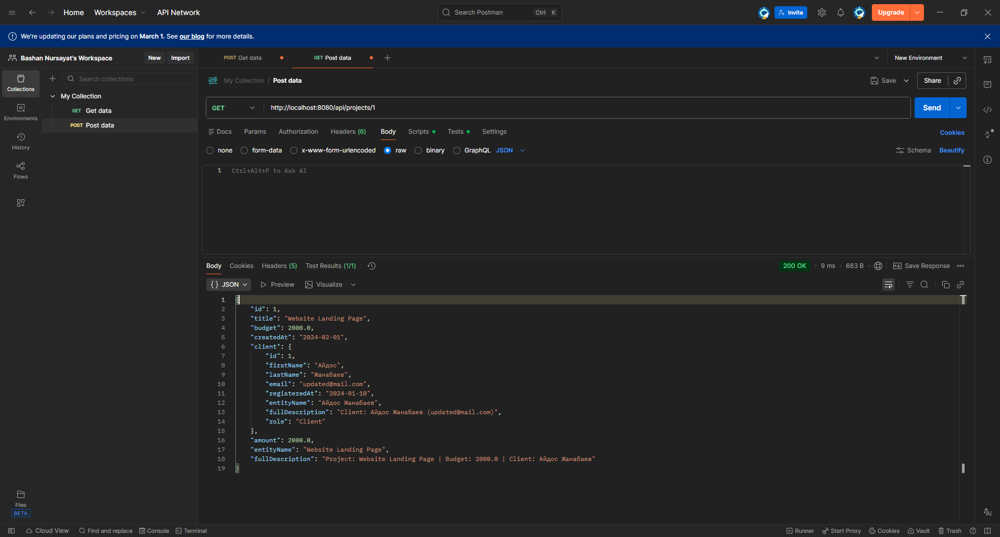
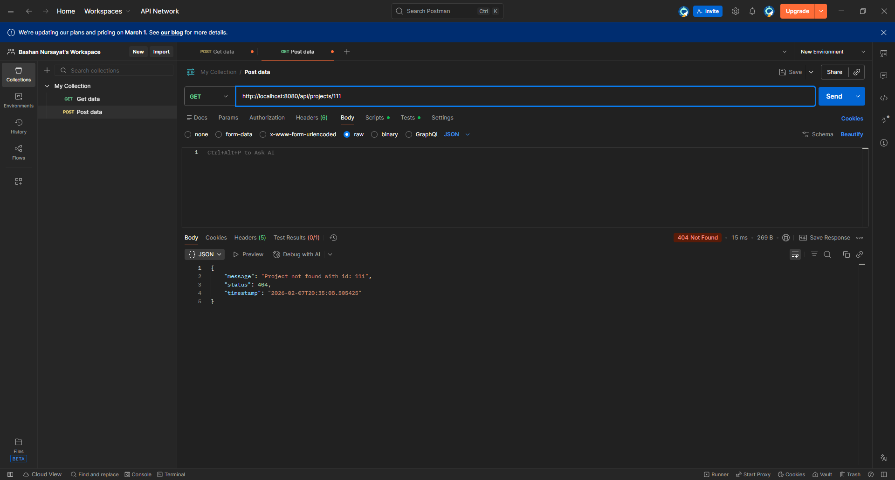
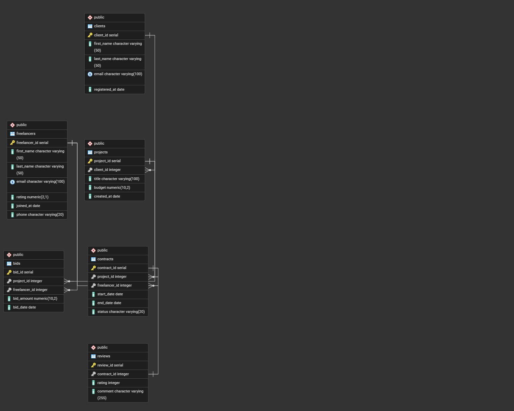
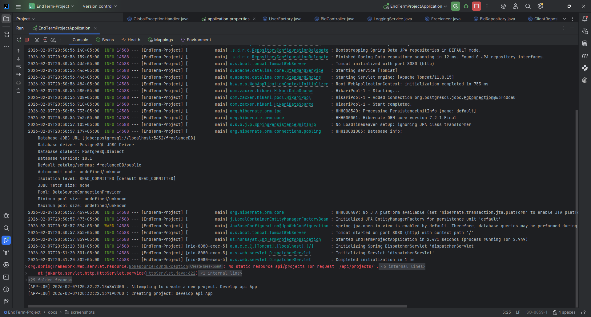

# Freelance Marketplace REST API

## A. Project Overview
**Freelance Marketplace** is a server-side RESTful application built with **Spring Boot**, designed to manage a freelance platform. The system allows for registering clients and freelancers, creating projects, and placing bids.

The project demonstrates a professional backend architecture, including the implementation of **GoF Design Patterns**, adherence to **SOLID principles** and **Component Principles** (REP, CCP, CRP), as well as **PostgreSQL** database integration via JDBC.

---

## B. REST API Documentation & Screenshots

The system provides CRUD operations for all entities. Below are example requests and proofs of functionality.

### 1. Clients
* `POST /api/clients` - Create a new client.
* `GET /api/clients` - Retrieve all clients.
* `GET /api/clients/{id}` - Retrieve a client by ID.

**Functionality Demo (POST & GET):**
> Successful client creation and data retrieval.



### 2. Projects
* `POST /api/projects` - Create a project (requires a Client ID).
* `GET /api/projects` - Retrieve projects with nested client data (JOIN).

**Get By ID Demo:**
> The system returns a nested structure (Project + Client).


### 3. Freelancers & Bids
* `POST /api/freelancers` - Register a new freelancer.
* `POST /api/bids` - Place a bid on a project.

---

## C. Error Handling

The project implements a global error interceptor (`GlobalExceptionHandler`). If a non-existent resource is requested or validation fails, the API returns a clear JSON response with the appropriate HTTP status code (404, 400, 500).

**Demo (404 Not Found):**
> Attempting to retrieve a non-existent client triggers a custom `ResourceNotFoundException`.


---

## D. Design Patterns Implementation (25 pts)

Three key Creational patterns are implemented in the project:

### 1. Singleton Pattern
* **Location:** `kz.nursayat.patterns.LoggingService`
* **Purpose:** Ensures a single point of access for logging throughout the application. Guarantees that the logging service is instantiated only once.
* **Usage:** Injected into all Service classes to track operations (`Creating`, `Updating`, `Deleting`).

### 2. Factory Pattern
* **Location:** `kz.nursayat.patterns.UserFactory`
* **Purpose:** Centralizes the user creation logic. Allows creating `Client` or `Freelancer` objects through a unified interface, hiding instantiation details.
* **Benefit:** Simplifies adding new roles (e.g., `Admin`) without modifying controller code.

### 3. Builder Pattern
* **Location:** Inner static classes in models (`Client.Builder`, `Project.Builder`, etc.).
* **Purpose:** Solves the "telescoping constructor" problem when creating complex objects.
* **Usage:** Actively used in the `Repository` layer to map SQL query results (`ResultSet`) to Java objects.

---

## E. Component Principles & Architecture (15 pts)

The package structure is designed according to Component Principles:

1.  **REP (Reuse/Release Equivalence Principle):**
    * Classes are grouped into modules (`service`, `repository`, `model`), allowing entire layers to be reused.
2.  **CCP (Common Closure Principle):**
    * Classes that change for the same reason are grouped together. For example, a change in the `clients` table schema will only affect the `model` and `repository` packages.
3.  **CRP (Common Reuse Principle):**
    * Unused utilities were removed, leaving only `ValidationUtils`, which is actively used across all models. This avoids dependencies on unnecessary code.

---

## F. SOLID & OOP Summary (10 pts)

* **SRP (Single Responsibility):**
    * `Controller` handles only HTTP requests.
    * `Service` handles only business logic and validation.
    * `Repository` handles only SQL queries.
* **OCP (Open/Closed):**
    * The system is open for extension (via inheritance of `BaseUser` and `BaseEntity`) but closed for modification of existing code.
* **LSP (Liskov Substitution):**
    * `Client` and `Freelancer` can be interchangeably used wherever `BaseUser` is expected.
* **ISP (Interface Segregation):**
    * Interfaces are split into specific ones: `Validatable` (for validation) and `Payable` (for financial entities).
* **DIP (Dependency Inversion):**
    * Services depend on abstractions (the `CrudRepository` interface or constructor injection), not on hard-coded implementations.

---

## G. Database Schema

The **PostgreSQL** database consists of 4 related tables.
> Database Schema (ER Diagram):


1.  **clients:** Stores customer data.
2.  **projects:** Linked to clients (One-to-Many). Deleting a client cascades to delete their projects.
3.  **freelancers:** Stores contractor data.
4.  **bids:** Junction table (Many-to-Many) between projects and freelancers.

---

## H. System Architecture (UML)

The class diagram shows the relationships between controllers, services, repositories, and patterns.
*(The diagram file is located at `docs/diagram.puml`)*

---

## I. Instructions to Run

**Console Output on Startup:**


1.  **Prerequisites:**
    * Java 17+ (JDK 25 was used for development).
    * PostgreSQL.
    * Maven.

2.  **Database Setup:**
    * Create a database named `freelanceDB`.
    * Run the `src/main/resources/schema.sql` script to create the tables.
    * Configure `src/main/resources/application.properties` (username/password).

3.  **Run:**
    ```bash
    ./mvnw spring-boot:run
    ```

---

## J. Reflection Section

### Challenges & Solutions
During development, I faced several challenges:
1.  **JSON Deserialization Error:** There was an issue where Jackson could not map `null` to `int id`. I solved this by adding the `spring.jackson.deserialization.fail-on-null-for-primitives=false` setting to the configuration.
2.  **SQL and Java Integration:** Correctly mapping a `ResultSet` to objects with nested structures (e.g., `Project` containing a `Client`) required careful use of the **Builder** pattern.
3.  **Architecture:** Transitioning from simple JDBC to a layered Spring Boot architecture required strict adherence to Dependency Injection.

### Key Takeaways
* I learned how to apply **Factory** and **Builder** patterns in real-world scenarios, not just in theory.
* I understood the importance of **DTOs** and proper **Jackson** configuration for REST APIs.
* I realized how **SOLID** principles make code testable and easy to maintain.